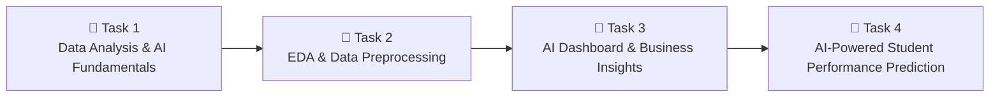

<div align="center">

# 📊 Data Science & AI Internship Portfolio

### 🚀 InternVision Tech | July 2026 Batch


---

*Transforming Data into Insights through Python, Analytics & Machine Learning.*

</div>

---

# 👋 About This Repository

Welcome!

This repository contains all the projects completed during my **4-Week Virtual Data Science & Artificial Intelligence Internship** at **InternVision Tech**.

Throughout this internship, I explored the complete Data Science workflow—from data collection and preprocessing to visualization, dashboard development, business insights, and Machine Learning model development.

Each task in this repository represents practical learning through hands-on implementation using real-world datasets and Python.

---

# 🏢 Internship Details

| Particular | Information |
|------------|-------------|
| Organization | InternVision Tech |
| Internship | Data Science & AI |
| Duration | 4 Weeks |
| Mode | Virtual |
| Batch | July 2026 |
| Status | Successfully Completed ✅ |

---

## 🚀 Internship Projects

| Task | Project | Skills Developed |
|:---:|---------|------------------|
| ✅ **Task 1** | Data Analysis & AI Fundamentals | Python, Pandas, NumPy, Data Visualization |
| ✅ **Task 2** | Exploratory Data Analysis & Data Preprocessing | Missing Values, Encoding, Feature Scaling, EDA |
| ✅ **Task 3** | AI Visualization Dashboard & Business Insights | Dashboard Design, KPIs, Charts, Business Insights |
| ✅ **Task 4** | AI-Powered Student Performance Prediction | Machine Learning, Regression Models, Model Evaluation |

---

# 📚 Skills Acquired

During this internship, I gained practical experience in:

- Python Programming
- Data Collection
- Data Cleaning
- Data Preprocessing
- Exploratory Data Analysis (EDA)
- Data Visualization
- Dashboard Development
- Business Insights Generation
- Feature Engineering
- Feature Scaling
- Machine Learning
- Model Training & Evaluation
- Predictive Analytics
- Git & GitHub

---

# 🛠 Technologies & Tools

| Category | Technologies |
|----------|--------------|
| Programming | Python |
| Data Analysis | Pandas, NumPy |
| Visualization | Matplotlib, Seaborn |
| Machine Learning | Scikit-learn |
| Development | Google Colab |
| Version Control | Git & GitHub |

---

# 📂 Repository Structure

```
InternVisionTech-DataScience-AI-Internship

│

├── Task-1 : Data Analysis & AI Fundamentals using Python
│   ├── Student Dataset
│   └── Data Analysis using Python

├── Task-2 : Exploratory Data Analysis & Data Preprocessing
│   ├── Healthcare Dataset
│   ├── EDA (Exploratory Data Analysis)
│   └── Data Preprocessing

├── Task-3 : AI Visualization Dashboard & Business Insights
│   ├── Sales Dashboard
│   ├── Business Insights
│   └── KPI Visualization

├── Task-4 : AI-Powered Student Performance Prediction System
│   ├── Student Performance Prediction
│   ├── Machine Learning Models
│   └── Model Comparison

└── README.md
```

---

# 🚀 Internship Journey



# 🏆 Internship Outcome

Through this internship, I developed practical knowledge of the complete Data Science pipeline—from understanding raw datasets to building predictive Machine Learning models.

Working on multiple projects improved my analytical thinking, programming skills, data visualization techniques, and understanding of AI concepts through hands-on implementation.

---

# 📜 Certificates

✅ Certificate of Completion :


✅ Certificate of Recognition : 


---

# 🤝 Connect With Me

### 💼 LinkedIn

www.linkedin.com/in/mansvi-pol

### 💻 GitHub

https://github.com/mansvi-pol

---

<div align="center">

⭐Thank you for visiting my repository!

If you found this repository interesting, feel free to explore my other projects or connect with me on LinkedIn.

Happy Learning & Happy Coding! 🚀


</div>
